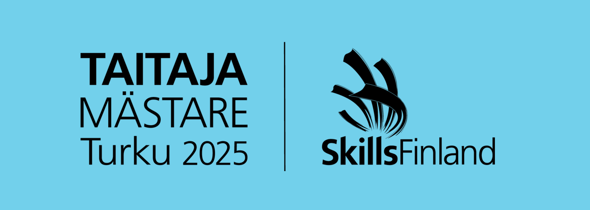

 

# Taitaja 2025 Web-kehitys kilpailutehtävät

## Semifinaali

Semifinaalitehtävässä kilpailijoiden tulee rakentaa **Taitaja TietoTesti**, selainpohjainen kysymyspeli, jossa opiskelijat voivat testata osaamistaan eri aihealueilla ja opettajat hallinnoida kysymyksiä hallintapaneelin kautta. Pelaajat valitsevat opettajan ja aihealueen, vastaavat monivalintakysymyksiin ja saavat välittömän palautteen.

## Finaali

Finaalitehtävässä kilpailijoiden on työskenneltävä yhdessä Hobbly Technoligies Oy:n kanssa ja luotava interaktiivinen palvelu, jonka avulla käyttäjät voivat löytää sijainnin perusteella uusia harrastusmahdollisuuksia ja yhteisöjä. 

### Moduuli A:

Tässä moduulissa kilpailijoiden tehtävänä on tutustua yrityksen toimeksiantoon ja suunnitella ratkaisu palvelulle. Suunnitteluehdotuksen lisäksi kilpailijoiden tulee tehdä rautalankamallit mobiilisovelluksesta ja hallintapaneelista. Tässä moduulissa toteutetut ehdotukset esitellään yrityksen edustajille Moduuli B tekemisen aikana. 

### Moduuli B:

Kilpailijoiden tulee toteuttaa hallintapaneeli, jolla hallitaan sovelluksen ilmoituksia ja käyttäjiä. Tämän moduulin työskentelyaikana jokainen kilpailija käy vuorollaan esittelemässä edellisessä moduulissa tekemäänsä suunnitteluehdotuksen yrityksen edustajille. 

### Moduuli C:

Tässä moduulissa kilpailijoiden tehtävänä on mobiilioptimoitu verkkosovellus, joka käyttää ja näyttää tietoja REST API -rajapinnasta. Tämän moduulin palautus yhdessä moduulin D kanssa. 

### Moduuli D:

Kilpailijoiden on luotava interaktiivinen karttanäkymä, joka näyttää tapahtumia Google Maps API:n avulla. Tämän moduulin palautus yhdessä moduulin C kanssa.

### Moduuli E:

Pikataival-moduulissa kilpailijoiden on ratkaistava lyhyitä ohjelmointitehtäviä ilman internetin apua. Tehtävissä on virheiden löytämistä ja korjaamista tai pienten toiminnallisuuksien toteuttamista.

### Moduuli F:

Kilpailijat suunnittelevat ryhmissä uuden digitaalisen palvelun, joka tukee yhteisöllisyyttä, paikallisia tapahtumia ja harrastumahdollisuuksia. Ensimmäisen tunnin aikana kilpailijat työstävät idean ja valmistelevat esityksen. Toisen tunnin aikana jokainen tiimi esittelee oman ideansa ja prototyyppinsä. 
